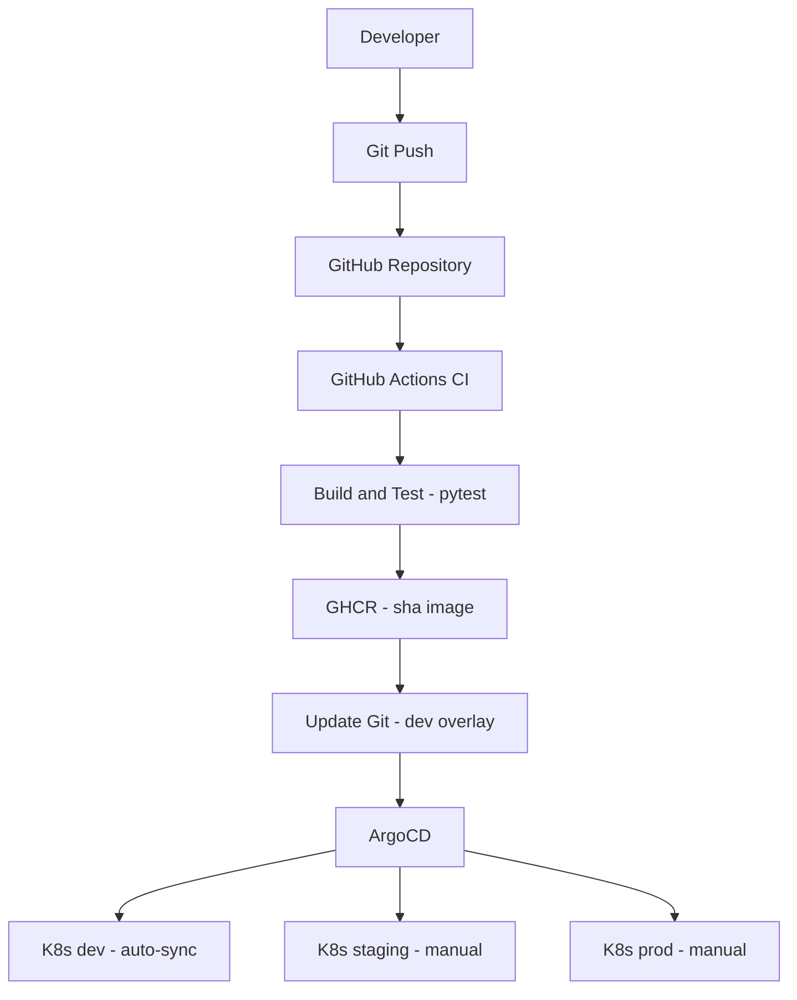

# Kubernetes Observability & GitOps — Project 3


A production-grade GitOps DevOps system combining CI, containerization, declarative deployment, and observability across dev, staging, and production environments.

* CI (GitHub Actions)
* Containerization (Docker + GHCR)
* GitOps (ArgoCD)
* Kubernetes (k3s)
* Observability (Prometheus + Grafana)
* Test-driven development (pytest)

The system is designed to be **deterministic, reproducible, and environment-aware**, with strict separation between build, delivery, and deployment.

---

## Architecture

### Architecture overview



CI builds immutable images which are propagated via Git into environment overlays and deployed by ArgoCD.

**Flow explanation (key points):**

* CI produces an immutable image (sha-based)
* The image is not deployed directly to Kubernetes
* Instead, CI updates the Git repository (dev overlay)
* ArgoCD detects the Git change and performs the deployment
* Promotion to staging and prod is controlled via Git changes (manual)

This enforces a strict separation between build, delivery, and deployment.

---

## Key Design Decisions

### DEC-001 — CI/CD Separation

* CI is repository-centric (GitHub Actions)
* CD is cluster-centric (ArgoCD)

---

### DEC-002 — Immutable Image Tags

Images are tagged as:

```
sha-<commit>
```

No mutable tags (like `latest`) are used.

---

### DEC-003 — Git as Source of Truth

Git stores:

* structure
* environment configuration

Git does NOT store runtime state.

---

### DEC-004 — Promotion & Rollback Strategy

Promotion:

* performed via Git (overlay update)

Rollback:

```
newTag: sha-previous
```

---

## Project Structure

```
.
├── app/
├── tests/
├── k8s/
│   ├── base/
│   └── overlays/
│       ├── dev/
│       ├── staging/
│       └── prod/
├── .github/workflows/
├── Dockerfile
├── requirements.txt
├── pytest.ini
```

---

## Application

Minimal Flask application:

* `/` → input form
* POST → square computation
* `/health`
* `/metrics`

Example:

```
Input: 5
Output: 25
```

---

## Testing Strategy (TDD-style)

Tests validate:

* endpoints
* input validation
* edge cases
* health endpoint

Run locally:

```
python -m pytest -q
```

Configuration:

```
[pytest]
testpaths = tests
```

---

## CI Pipeline

Stages:

1. Test (pytest)
2. Build (Docker)
3. Push (GHCR)
4. Update dev overlay

```
No artifact is produced unless tests pass
```

---

## Deployment Model

Namespaces:

```
proj3-dev
proj3-staging
proj3-prod
```

---

## GitOps (ArgoCD)

| Environment | Mode      |
| ----------- | --------- |
| dev         | auto-sync |
| staging     | manual    |
| prod        | manual    |

---

## Promotion Flow

```
dev → staging → prod
```

---

## Rollback Strategy

Rollback = redeploy previous SHA

---

## Observability

Prometheus:

* scrapes `/metrics`

Grafana:

* dashboards

---

## How to Run Locally

### Prerequisites

* Docker
* Python 3.11+
* kubectl (optional, for port-forward)

### 1) Run tests

```bash
python -m pytest -q
```

### 2) Run app locally

```bash
pip install -r requirements.txt
python app/app.py
```

Open: [http://127.0.0.1:8080](http://127.0.0.1:8080)

### 3) Run via Docker

```bash
docker build -t proj3-app:local .
docker run -p 8080:80 proj3-app:local
```

Open: [http://127.0.0.1:8080](http://127.0.0.1:8080)

### 4) (Optional) Access in cluster via port-forward

```bash
kubectl port-forward svc/proj3-app 8080:80
```

Open: [http://127.0.0.1:8080](http://127.0.0.1:8080)

---

## Security

* GHCR private images

* Kubernetes `imagePullSecrets`

* GHCR private images

* Kubernetes `imagePullSecrets`

---

## What This Project Demonstrates

* full DevOps lifecycle
* GitOps deployment model
* immutable infrastructure approach
* environment-based promotion
* integrated testing strategy

---

## Engineering Perspective

This project demonstrates a clear mental model of modern DevOps systems:

* CI is responsible for building and validating artifacts
* Git is the single source of truth
* CD is pull-based (ArgoCD), not push-based
* Environments are controlled via declarative configuration

This results in:

* reproducible deployments
* traceable changes
* controlled promotion across environments

---

## Key Takeaway

```
This project demonstrates how a system is designed, controlled, and evolved
```
